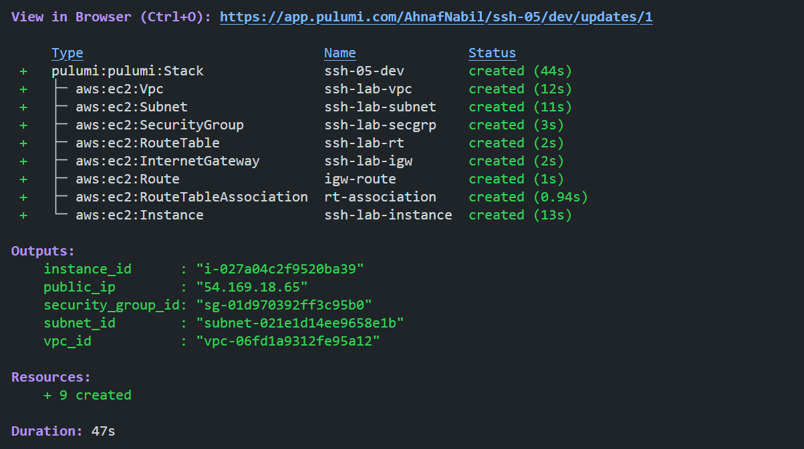
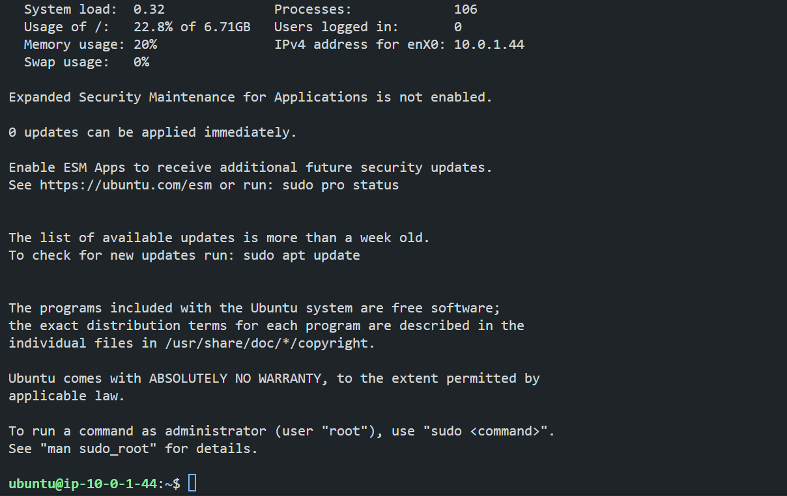

# Provision an AWS EC2 Instance using Pulumi

First, we need to provision an EC2 instance on AWS using Pulumi.

### Configure AWS CLI

Configure AWS CLI with the necessary credentials. Run the following command and follow the prompts to configure it:

```bash
aws configure
```

This will prompt you to enter the following details:

- AWS Access Key ID
- AWS Secret Access Key
- Default region name (e.g., ap-southeast-1)
- Default output format (e.g., json)

Fill in the details using the generated credentials in `Poridhi Labs`.

### Set Up a Pulumi Project

1. Install python virtual environment:

   ```bash
   sudo apt update
   sudo apt install python3.8-venv
   ```

2. Create a new directory and initialize a Pulumi project:

   ```bash
   mkdir ssh-lab-pulumi && cd ssh-lab-pulumi
   pulumi new aws-python
   ```

   This command creates a new directory with the basic structure for a Pulumi project. Follow the prompts to set up your project.

3. Create a new key pair for our instances using the following command:

   ```bash
   aws ec2 create-key-pair --key-name MyKeyPair --query 'KeyMaterial' --output text > MyKeyPair.pem
   ```

4. Set File Permissions of the key files:

   ```bash
   chmod 400 MyKeyPair.pem
   ```

5. Replace the contents of `__main__.py` with the following code:

   ```python
   import pulumi
   import pulumi_aws as aws

   # Create a VPC
   vpc = aws.ec2.Vpc("ssh-lab-vpc",
      cidr_block="10.0.0.0/16",
      enable_dns_hostnames=True,
      enable_dns_support=True,
      tags={
         "Name": "ssh-lab-vpc",
      })

   # Create a public subnet
   public_subnet = aws.ec2.Subnet("ssh-lab-subnet",
      vpc_id=vpc.id,
      cidr_block="10.0.1.0/24",
      availability_zone="ap-southeast-1a",
      map_public_ip_on_launch=True,
      tags={
         "Name": "ssh-lab-subnet",
      })

   # Create an Internet Gateway
   internet_gateway = aws.ec2.InternetGateway("ssh-lab-igw",
      vpc_id=vpc.id,
      tags={
         "Name": "ssh-lab-igw",
      })

   # Create a Route Table
   public_route_table = aws.ec2.RouteTable("ssh-lab-rt",
      vpc_id=vpc.id,
      tags={
         "Name": "ssh-lab-rt",
      })

   # Create a route in the Route Table for the Internet Gateway
   route = aws.ec2.Route("igw-route",
      route_table_id=public_route_table.id,
      destination_cidr_block="0.0.0.0/0",
      gateway_id=internet_gateway.id)

   # Associate Route Table with Public Subnet
   rt_association = aws.ec2.RouteTableAssociation("rt-association",
      subnet_id=public_subnet.id,
      route_table_id=public_route_table.id)

   # Create a Security Group for the SSH Lab Instance
   ssh_security_group = aws.ec2.SecurityGroup("ssh-lab-secgrp",
      vpc_id=vpc.id,
      description="Allow SSH access",
      ingress=[
         # SSH access from anywhere
         {"protocol": "tcp", "from_port": 22, "to_port": 22, "cidr_blocks": ["0.0.0.0/0"]}
      ],
      egress=[
         # Allow all outbound traffic
         {"protocol": "-1", "from_port": 0, "to_port": 0, "cidr_blocks": ["0.0.0.0/0"]}
      ],
      tags={
         "Name": "ssh-lab-secgrp",
      })

   # Define an AMI for the EC2 instance (Ubuntu 24.04 LTS)
   ami_id = "ami-01811d4912b4ccb26"  # Ubuntu 24.04 LTS, update if needed for your region

   # Create the SSH Lab EC2 Instance
   ssh_lab_instance = aws.ec2.Instance("ssh-lab-instance",
      instance_type="t2.micro",
      vpc_security_group_ids=[ssh_security_group.id],
      ami=ami_id,
      subnet_id=public_subnet.id,
      key_name="MyKeyPair",
      associate_public_ip_address=True,
      tags={
         "Name": "ssh-lab-instance",
         "Environment": "Lab",
         "Project": "SSHLab"
      })

   # Export the relevant outputs
   pulumi.export("vpc_id", vpc.id)
   pulumi.export("subnet_id", public_subnet.id)
   pulumi.export("security_group_id", ssh_security_group.id)
   pulumi.export("instance_id", ssh_lab_instance.id)
   pulumi.export("public_ip", ssh_lab_instance.public_ip)
   ```

6. Deploy the infrastructure:

   ```bash
   pulumi up
   ```

   This will create the necessary resources in AWS.
   So, our ec2 instance is ready and it is a linux server. Now, we can ssh into it using the key pair we created.

   

>**Note:** Remember the public IP address of the instance for later use.

7. Connect to the EC2 instance using SSH:

   ```bash
   ssh -i MyKeyPair.pem ubuntu@<public_ip>
   ```

   